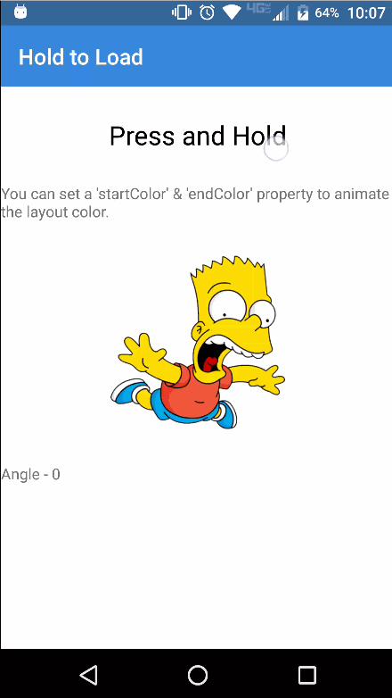

[](https://www.npmjs.com/package/nativescript-hold-to-load)
[](https://www.npmjs.com/package/nativescript-hold-to-load)

# NativeScript-Hold-To-Load
Nativescript plugin for press (hold) background animation

## Samples



#### Native Library


## Installation
From your command prompt/termial go to your app's root folder and execute:

`npm install nativescript-hold-to-load`


## Usage
#### XML:
```XML
<Page 
  xmlns="http://schemas.nativescript.org/tns.xsd" 
  xmlns:HL="nativescript-hold-to-load" loaded="pageLoaded">
  <ActionBar title="Hold to Load" />
  <StackLayout>
    
    <HL:HoldToLoadLayout duration="1000" startColor="#3489db" strokeWidth="50" stopWhenFilled="true" holdComplete="{{ completed }}" holdReset="{{ reset }}">
        <Label text="Press and Hold" class="message" textWrap="true"/>
    </HL:HoldToLoadLayout>


    <HL:HoldToLoadLayout startColor="#ff4081" endColor="#336699" strokeWidth="120" strokeAlpha="225" holdComplete="{{ completed }}" holdReset="{{ reset }}" angleChange="{{ angleChange }}">
        <Image src="~/images/bart.png" class="circle-image" stretch="aspectFit" />
    </HL:HoldToLoadLayout>

  </StackLayout>
</Page>

```


## Attributes
**startColor - (color string)** - *required*

Attribute to set the starting color.
 
**endColor - (color string)** - *optional*

Attribute to set the ending color of the gradient, if not specified the startColor will be used.

**duration - (number)** - *optional*

Set duration of fill time in milliseconds. Default is 1500.


**strokeWidth - (number)** - *optional*
Sets the stroke width. Default is 0.

**strokeAlpha - (number)** - *optional*
Sets the paint's alpha value. ** Value range is between 0 & 255. ** Default alpha value is 255.

**playReverseAnimation - (boolean)** - *optional*
Sets if to animate the reverse animation. If set false, the loading will disappear instantly. Default is true.

**stopWhenFilled - (boolean)** - *optional*
If set true, loading will stop when it's completed. If set false, loading will be reversed even if it is full. Default is true.

**startAngle - (number)** - *optional*
Set the loading's starting point as angle. Default value is 270.